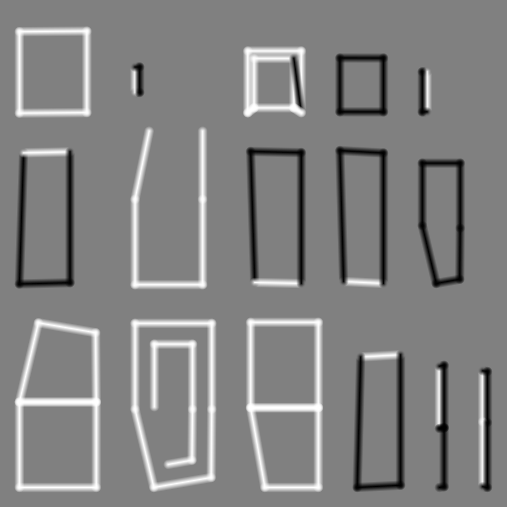

# Curvature Baker

Utility addon that bakes grayscale curvature maps from a mesh.

## Usage

Instanciate the `curvature_baker.tscn` scene and call the `bake_curvature_map` function on it. It takes a mesh and the line thickness.

## Results

**The model with the curvature map applied:**

**The baked curvature texture:**

## Issues

Sometimes the angle isn't correct and black or white lines appear where they shouldn't.
